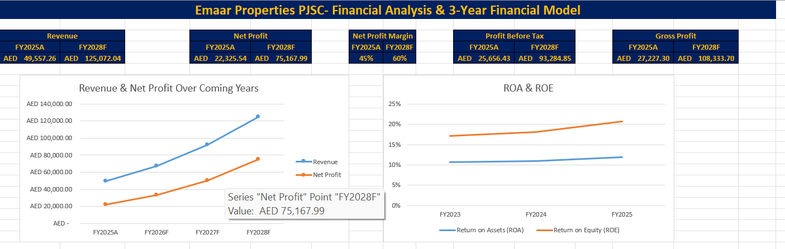
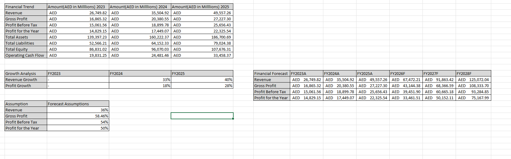
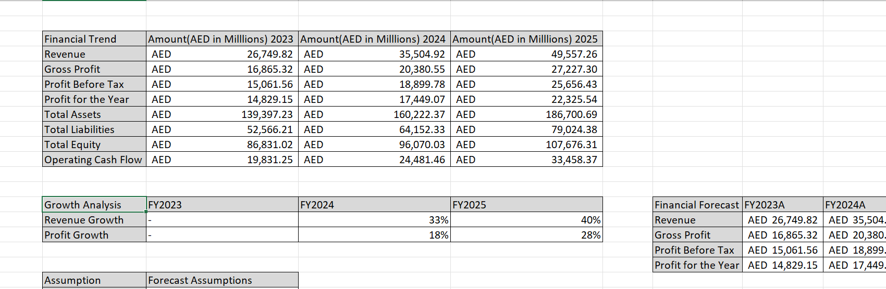

# Emaar 3-Year Financial Model

## Project Overview

A 3-year financial modelling and analysis project based on **Emaar Properties**, developed in Microsoft Excel to demonstrate practical skills in financial analysis, forecasting, financial modelling, and data visualization.

The model analyses historical financial data and uses calculated average percentage changes to develop a structured 3-year financial outlook.

## Dashboard

The dashboard presents key financial metrics and visualizations, including revenue, net profit, profit margins, ROA, ROE, and projected financial performance.

## Objectives

- Analyse historical financial performance
- Calculate key financial metrics and percentage changes
- Calculate average percentage changes from historical data
- Apply calculated average percentages to develop a 3-year financial outlook
- Build a structured financial model using Microsoft Excel
- Present key financial results through a dashboard

## Methodology

1. Historical financial data was organised and analysed in Excel.
2. Year-over-year percentage changes were calculated for relevant financial items.
3. Average percentage changes were calculated from the historical data.
4. The calculated average percentages were applied as forecast assumptions.
5. The assumptions were used to develop the 3-year financial outlook.
6. Key financial results were presented through a dashboard.

## Financial Model

The financial model includes historical financial data, growth analysis, forecast assumptions, and projected financial figures.

## Financial Analysis

The analysis includes revenue, gross profit, profit before tax, profit for the year, assets, liabilities, equity, operating cash flow, and growth calculations.

## Key Areas Covered

- Revenue Analysis
- Gross Profit Analysis
- Profitability Analysis
- Revenue Growth
- Profit Growth
- Financial Forecasting
- Financial Statement Analysis
- ROA & ROE Analysis
- Financial Dashboard
- Data Visualization

## Tools & Skills

### Tool

- Microsoft Excel

### Skills Demonstrated

- Financial Modelling
- Financial Analysis
- Forecasting
- Excel Formulas
- Percentage & Trend Analysis
- Financial Statement Analysis
- Data Visualization
- Dashboard Development

## Disclaimer

This project is created for **educational and portfolio purposes**. The analysis and projections are based on the assumptions and methodology used within the model and should not be considered investment advice or an official forecast of Emaar Properties.

## Author

**Anas Abdul Rahim Khatib**

Finance & Accounting | Financial Analysis | Excel | Business Analytics
